<div align="center">

# ccsl

**Claude Code Statusline**

A rich, information-dense statusline for Claude Code.

[](https://www.npmjs.com/package/ccsl)
[](LICENSE)
[](https://nodejs.org)
[](#)

</div>

---

ccsl replaces Claude Code's default statusline with a dense, color-coded ANSI badge display. It shows your model and plan, session duration, cost, context window usage, git status, file changes, PR links, active tools, sub-agents, task progress, and more — all rendered as compact badges with gradient backgrounds that shift color based on values.


### Contents

- [Layouts](#layouts) · [Badge Reference](#badge-reference) · [Quick Start](#quick-start) · [Configuration](#configuration) · [Width Modes](#width-modes)
- [How It Works](#how-it-works) · [Privacy](#privacy) · [See Also](#see-also) · [Contributing](#contributing)

---

## Layouts

Three layout modes — **dense** (fixed header rows, default), **semantic** (one category per row), and **adaptive** (auto-wrapping stream). Badges have colored backgrounds that shift based on values — cost from green to red, duration from green to purple, context bars from green to yellow to red.

---

## Badge Reference


Every badge the statusline can show, with all possible states:

| Badge | Description | States |
|---|---|---|
| **Model / Plan** | Current Claude model and subscription plan | `Opus`, `Sonnet \| Pro`, `Opus \| Max` |
| **Duration** | Session wall-clock time. Background shifts green → gold → purple | `30s`, `12m`, `1h 30m`, `3h` |
| **Cost** | Cumulative API cost. Background shifts green → gold → orange → red | `$0.42`, `$4.82`, `$50`, `$123` |
| **Context window** | Visual progress bar of token usage with color-coded fill | Green (<70%), yellow (70–84%), red (≥85%) |
| **Cache breakdown** | Token split: cache read / cache write / uncached | `🔥 12kr·5kw·800u` |
| **Usage rate limit** | Anthropic API utilization with reset timer | `⚡ 12% (4h 23m / 5h)` — bar fills green/yellow/red |
| **Repo name** | Git repository name | `ccsl`, `my-project` |
| **Branch / Worktree** | Current branch (🌿) or worktree (🌳). Main/master shown in purple | `🌿 main`, `🌿 feature/auth`, `🌳 fix-login` |
| **File stats** | Dirty file counts: modified (!), added (+), deleted (✘), untracked (?) | `!3`, `!1+2?4`, `!5+3✘1?2` |
| **Ahead / Behind** | Commits ahead/behind remote tracking branch | `↑3`, `↓2`, `↑5↓1` |
| **Lines changed** | Total lines added (green) and removed (red) in session | `📊 +284-67` |
| **Config summary** | Counts of CLAUDE.md files, MCP servers, and hooks | `📋 2 CLAUDE.md \| 5 MCPs \| 3 hooks` |
| **Ticket marker** | Jira-style ticket ID extracted from PR title | `🎫 PROJ-123` |
| **PR link** | Clickable PR with status: Draft, Open, Mergeable (✅), Merged, Closed | `🔗 PR#42 (D)`, `(O)`, `(✅)`, `(M)`, `(C)` |
| **Recall status** | Whether `/recall` was run this session | `🧩 ✓` (recalled), `🧩 ✗` (not recalled) |
| **Learn status** | Compact relative time since last `/learn`, plus unprocessed observation count or ✓ | `📚 15m ✓` (recent, all processed), `📚 3d 1418` (3 days ago, 1418 pending), `📚 ⚠ 500` (pending) |
| **Instinct status** | Active instinct count with promotion/correction indicators | `🧬 21` (normal), `🧬 21 ▲3` (3 promotable), `🧬 21 !` (corrections detected) |
| **Remote Control** | Claude Code [Remote Control](https://code.claude.com/docs/en/remote-control) status | `📱 RC`, `📱 local` |
| **Transcript link** | Clickable `file://` hyperlink to session transcript | `📝 session-abc.jsonl` |
| **Running tool** | Currently executing tool with target | `◐ Bash: npm test`, `◐ Read: src/types.ts` |
| **Completed tools** | Tool use counts, color-coded by category | `Read×12`, `Grep×6`, `Bash×8`, `WebSearch×1` |
| **MCP tools** | MCP tool counts grouped by server | `🔌playwright×6`, `🔌context7×3` |
| **Running agent** | Active Task subagent with elapsed time | `◐ feature Review auth… (2m 30s)` |
| **Completed agents** | Recent finished agents (max 2) with duration | `✓ feature Review auth… 2m` |
| **Tasks** | Current task from TodoWrite with progress | `▸ Add rate limiting (3/6)`, `✓ All done (6/6)` |

> **Note:** Badges marked with `features.*` in the reference image require the corresponding feature toggle in config.

---

## Quick Start

### 1. Install

```bash
npm install -g ccsl
```

### 2. Configure Claude Code

Add to your `~/.claude/settings.json`:

```json
{
  "statusLine": {
    "type": "command",
    "command": "ccsl"
  }
}
```

That's it. Claude Code will pipe status data to ccsl on every update.

---

## Configuration

### Interactive Setup

The easiest way to configure ccsl is the interactive wizard:

```bash
ccsl setup
```

This walks you through preset selection, row composition, flex settings, and feature toggles — with a live preview of your statusline before saving.

### Config File

Configuration is stored in `~/.claude/statusline-config.json`. The `rows` array defines which badge groups appear on each row:

```json
{
  "rows": [
    ["identity", "learning", "remoteControl"],
    ["context", "usage", "config"],
    ["git", "pr"],
    "---",
    ["transcript", "tools"],
    ["agents"],
    ["todos"]
  ],
  "flexMode": "full-until-compact",
  "compactThreshold": 85,
  "flexPadding": 6,
  "features": {
    "usage": false,
    "learning": false,
    "remoteControl": false
  }
}
```

Each row is an array of badge group IDs. Use `"---"` for a separator line. Rows with no output (e.g., no agents running) are automatically hidden.

### Badge Groups

| ID | Badges |
|---|---|
| `identity` | Model/plan, duration, cost |
| `context` | Context bar, token breakdown |
| `usage` | API rate limit bar |
| `git` | Repo, branch, file stats, ahead/behind, lines |
| `config` | CLAUDE.md count, MCPs, hooks |
| `pr` | Ticket marker, PR link |
| `learning` | Recall, learn, instinct |
| `remoteControl` | Remote control status |
| `transcript` | Session transcript link |
| `tools` | Running/completed tools, MCP tools |
| `agents` | Running/completed agents |
| `todos` | Todo progress |

### Presets

Three preset starting points (available via `ccsl setup`):

- **Dense** (default) — Compact multi-row layout. Groups related badges together on shared rows.
- **Semantic** — One category per row. More vertical, easier to scan.
- **Adaptive** — All badges on a single auto-wrapping line.

### Layout & Display

| Option | Description | Default |
|---|---|---|
| `rows` | Row composition array (see above) | Dense preset |
| `flexMode` | Terminal width strategy (see [Width Modes](#width-modes)) | `full-until-compact` |
| `compactThreshold` | Context % that triggers compact width in `full-until-compact` mode (1–99) | `85` |
| `flexPadding` | Chars subtracted from terminal width in `full` mode | `6` |

> **Backwards compatibility:** Old configs using `"layout": "dense"` / `"semantic"` / `"adaptive"` still work — they're mapped to equivalent row presets.

### Feature Toggles

| Option | Description | Default |
|---|---|---|
| `features.usage` | Show Anthropic API usage rate limit bar (see [privacy note](#privacy)) | `false` |
| `features.learning` | Show recall/learn/instinct status badges (for custom learning loop integration) | `false` |
| `features.remoteControl` | Show Claude Code [Remote Control](https://code.claude.com/docs/en/remote-control) status badge | `false` |

### Width Modes

Claude Code shares the statusline row with system notifications (e.g., "Context left until auto-compact...") that appear on the right side and can truncate your output. The `flexMode` setting controls how ccsl adapts to the available width:

| Mode | Behavior |
|---|---|
| `full` | Uses `terminalWidth - flexPadding`. Best for wide terminals without notifications. |
| `full-minus-40` | Always reserves 40 chars for Claude Code notifications. Safe but less dense. |
| `full-until-compact` | Uses full width normally, switches to `-40` when context usage exceeds `compactThreshold`. Best balance — only goes narrow when the auto-compact notification is likely to appear. |

ccsl also replaces spaces with non-breaking spaces and prefixes each line with an ANSI reset code to prevent Claude Code from trimming or dimming the output.

---

## How It Works

```mermaid
flowchart TD
    A[Claude Code<br/>Status hook] --> B[stdin JSON]
    B --> C[ccsl]
    C --> D[Git info]
    C --> E[Transcript]
    C --> F[Config counts]
    C --> G[Usage API*]
    D --> H[Render badges]
    E --> H
    F --> H
    G --> H
    H --> I[stdout ANSI]

    style A fill:#2d4a2d
    style C fill:#38608c
    style I fill:#2d4a2d
    style G fill:#5f3a1c
```



ccsl is a [StatusLine command](https://code.claude.com/docs/en/settings) — Claude Code pipes a JSON object to stdin on every status update. ccsl gathers additional context (git state, transcript history, config files, optionally the usage API), renders everything as ANSI-colored badges, and writes the result to stdout.

\* Usage API is optional and requires `features.usage: true` in config.

---

## Privacy

When `features.usage` is **disabled** (the default), ccsl reads only local files (git state, transcript, config). No network requests are made and no credentials are accessed.

When `features.usage` is **enabled**, ccsl reads your Claude OAuth token from `~/.claude/.credentials.json` (or macOS Keychain) to query the Anthropic usage API. The token is used solely for this request and is never stored, logged, or transmitted elsewhere.

---

## See Also

- **[Remote Control](https://code.claude.com/docs/en/remote-control)** — Claude Code's built-in feature for continuing local sessions from your phone, tablet, or browser. When enabled, ccsl shows the RC status as a badge (enable with `features.remoteControl: true`).

## Acknowledgments

Based on work by [Aaro Korhonen](https://github.com/aarokorhonen).

---

## Contributing

Contributions are welcome! This is a small project — open an issue or submit a PR.

```bash
git clone https://github.com/laveez/ccsl.git
cd ccsl
npm install
npm run dev    # Watch mode — rebuilds on change
```

## License

[MIT](LICENSE)
