<div align="center">

# ccsl

**Claude Code Statusline**

A rich, information-dense terminal statusline for Claude Code.

[](LICENSE)
[](https://nodejs.org)
[](#)

</div>

---

ccsl replaces Claude Code's default statusline with a dense, color-coded ANSI badge display. It shows your model and plan, session duration, cost, context window usage, git status, file changes, PR links, active tools, sub-agents, task progress, and more — all rendered as compact badges with gradient backgrounds that shift color based on values.

## Example

The dense layout (default) renders like this:

```
 Opus 4 | Max   ⏲ 12m 34s   💸 $1.24   🧩 ✓   📚 today
 🧠 ██████░░░░ 45k=45%   🔥 120kr·8.2kw·3.1ku   📋 2 CLAUDE.md | 3 MCPs | 2 hooks
 my-project   🌿 feature/auth   !3+1?2   ↑2   📊 +142-38   🔗 PR#47 (✅)
────────────────────────────────────────────────────────────
 📝 abc12…jsonl   Read×24  Edit×8  Bash×12  Grep×6  Glob×4  🔌playwright×3
```

Each badge has a colored background — cost badges shift from green to gold to red as spending increases, duration badges shift from green to purple over time, and context/usage bars fill with green, yellow, or red segments.

## Features

- **Context window bar** — visual progress bar with token counts, cache breakdown (read/write/uncached), and color-coded fill
- **Gradient badges** — cost, duration, and usage badges shift color based on value thresholds
- **Git integration** — repo name, branch/worktree, file stats (modified/added/deleted/untracked), ahead/behind counts, lines changed
- **PR status** — clickable PR link with status indicator (draft, open, mergeable, merged, closed)
- **Tool tracking** — running tools with targets, completed tool counts grouped by type, MCP tools grouped by server
- **Sub-agent tracking** — running and recently completed Task agents with duration and description
- **Task progress** — current in-progress task subject with completion count
- **Transcript link** — clickable `file://` hyperlink to the session transcript
- **Usage rate limit bar** — Anthropic API utilization with reset timer (requires Claude subscription credentials)
- **Config summary** — counts of CLAUDE.md files, MCP servers, and hooks across user and project scopes
- **Narrow terminal support** — emojis automatically replaced with text abbreviations below 80 columns
- **Zero dependencies** — pure Node.js, no external packages

## Quick Start

### 1. Install

```bash
npm install -g ccsl
```

### 2. Configure Claude Code

Add to your `~/.claude/settings.json`:

```json
{
  "statusLine": {
    "type": "command",
    "command": "ccsl"
  }
}
```

That's it. Claude Code will pipe status data to ccsl on every update.

## Configuration

Create `~/.claude/statusline-config.json` to customize behavior:

```json
{
  "layout": "dense",
  "features": {
    "usage": false,
    "learning": false,
    "cctg": false
  }
}
```

| Option | Description | Default |
|---|---|---|
| `layout` | Layout mode (`dense`, `semantic`, `adaptive`) | `dense` |
| `features.usage` | Show Anthropic API usage rate limit bar (requires Claude subscription credentials) | `false` |
| `features.learning` | Show recall/learn status badges (for custom learning loop integration) | `false` |
| `features.cctg` | Show [cctg](https://github.com/laveez/cctg) (Claude Code Telegram Gate) status badge | `false` |

## Layouts

- **Dense** — packs the most information into 3 header rows plus detail rows. Identity, context, and git each get a row, with tools and agents below a separator. Best for wide terminals.
- **Semantic** — groups badges by category, each on its own row (identity, context, git, config/PR, learning). More readable at the cost of vertical space.
- **Adaptive** — flows all badges into a single auto-wrapping stream. Minimal structure, maximum density.

## How It Works

```mermaid
flowchart TD
    A[Claude Code<br/>Status hook] --> B[stdin JSON]
    B --> C[ccsl]
    C --> D[Git info]
    C --> E[Transcript]
    C --> F[Config counts]
    C --> G[Usage API*]
    D --> H[Render badges]
    E --> H
    F --> H
    G --> H
    H --> I[stdout ANSI]

    style A fill:#2d4a2d
    style C fill:#38608c
    style I fill:#2d4a2d
    style G fill:#5f3a1c
```



ccsl is a [StatusLine command](https://docs.claude.com/en/docs/claude-code/settings#statusline) — Claude Code pipes a JSON object to stdin on every status update. ccsl gathers additional context (git state, transcript history, config files, optionally the usage API), renders everything as ANSI-colored badges, and writes the result to stdout.

\* Usage API is optional and requires `features.usage: true` in config.

## Acknowledgments

Based on work by [Aaro Korhonen](https://github.com/aarokorhonen).

## Contributing

Contributions are welcome! This is a small project — open an issue or submit a PR.

```bash
git clone https://github.com/laveez/ccsl.git
cd ccsl
npm install
npm run dev    # Watch mode — rebuilds on change
```

## License

[MIT](LICENSE)
