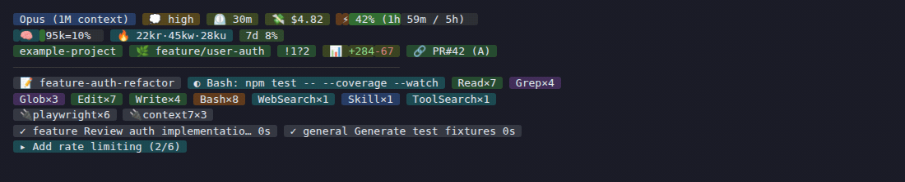
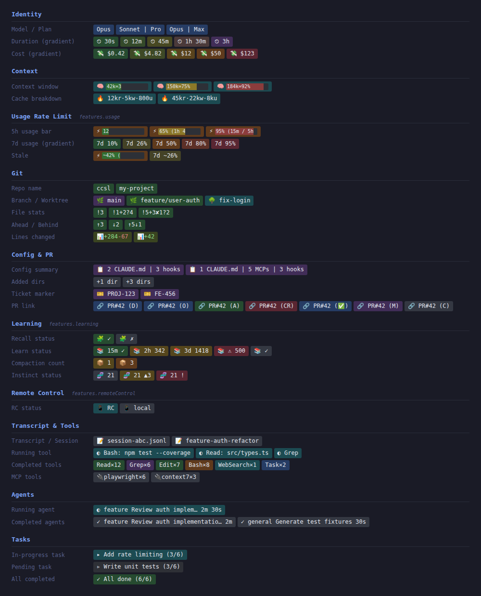

<div align="center">

# ccsl

**Claude Code Statusline**

A rich, information-dense statusline for Claude Code.

[](https://www.npmjs.com/package/ccsl)
[](LICENSE)
[](https://nodejs.org)
[](#)

</div>

---

ccsl replaces Claude Code's default statusline with a dense, color-coded ANSI badge display. It shows your model, reasoning effort, session duration, cost, context window usage, rate limits, git status, file changes, PR links, active tools, sub-agents, task progress, and more — all rendered as compact badges with gradient backgrounds that shift color based on values.



### What's New

**v0.4.0** — Stock Claude Code only: removed the custom learning-loop and Remote Control badges and the legacy usage-API polling (no network requests or credential access at all anymore — rate limits come natively from Claude Code). New badges for new Claude Code data: fast mode marker, reasoning effort (`💭 high`), agent sessions (`🤖`). PR badge now uses the native `pr` field (no `gh` subprocess on recent Claude Code), context percentage prefers the native value, and width detection uses the `COLUMNS` env var Claude Code sets since 2.1.153.

**v0.3.0** — Native rate limits from Claude Code 2.1.80+ (no more API calls/keychain access), PR review decision badges with dynamic colors (green approved, rose changes requested, purple merged), `added_dirs` badge, session name in transcript badge.

**v0.2.7** — Documentation and release housekeeping.

See all changes in [Releases](https://github.com/laveez/ccsl/releases).

### Contents

- [Layouts](#layouts) · [Badge Reference](#badge-reference) · [Quick Start](#quick-start) · [Configuration](#configuration) · [Width Modes](#width-modes)
- [How It Works](#how-it-works) · [Privacy](#privacy) · [Contributing](#contributing)

---

## Layouts

Three layout modes — **dense** (fixed header rows, default), **semantic** (one category per row), and **adaptive** (auto-wrapping stream). Badges have colored backgrounds that shift based on values — cost from green to red, duration from green to purple, context bars from green to yellow to red.

---

## Badge Reference



Every badge the statusline can show, with all possible states:

| Badge | Description | States |
|---|---|---|
| **Model / Fast mode** | Current Claude model, with a marker when [fast mode](https://code.claude.com/docs/en/fast-mode) is on | `Opus`, `Sonnet`, `Fable \| fast` |
| **Reasoning effort** | Current effort level, color-coded (steel → blue → gold → orange → rose). Shows `off` when extended thinking is disabled | `💭 low`, `💭 medium`, `💭 high`, `💭 xhigh`, `💭 max`, `💭 off` |
| **Agent session** | Agent name when running with `--agent` | `🤖 security-reviewer` |
| **Duration** | Session wall-clock time. Background shifts green → gold → purple | `30s`, `12m`, `1h 30m`, `3h` |
| **Cost** | Cumulative API cost. Background shifts green → gold → orange → red | `$0.42`, `$4.82`, `$50`, `$123` |
| **Context window** | Visual progress bar of token usage with color-coded fill | Green (<70%), yellow (70–84%), red (≥85%) |
| **Cache breakdown** | Token split: cache read / cache write / uncached | `🔥 12kr·5kw·800u` |
| **Usage (5h)** | 5-hour rate limit bar with reset timer, from Claude Code's native rate limit data | `⚡ 12% (4h 23m / 5h)` — bar fills green/yellow/red |
| **Usage (7d)** | 7-day rolling rate limit | `7d 26%` |
| **Repo name** | Git repository name | `ccsl`, `my-project` |
| **Branch / Worktree** | Current branch (🌿) or worktree (🌳). Main/master shown in purple | `🌿 main`, `🌿 feature/auth`, `🌳 fix-login` |
| **File stats** | Dirty file counts: modified (!), added (+), deleted (✘), untracked (?) | `!3`, `!1+2?4`, `!5+3✘1?2` |
| **Ahead / Behind** | Commits ahead/behind remote tracking branch | `↑3`, `↓2`, `↑5↓1` |
| **Lines changed** | Total lines added (green) and removed (red) in session | `📊 +284-67` |
| **Config summary** | Counts of CLAUDE.md files, MCP servers, and hooks | `📋 2 CLAUDE.md \| 5 MCPs \| 3 hooks` |
| **Ticket marker** | Jira-style ticket ID extracted from PR title (gh fallback path only) | `🎫 PROJ-123` |
| **PR link** | Clickable PR with status: Draft, Open, Approved, Changes requested, Mergeable (✅), Merged, Closed | `🔗 PR#42 (D)`, `(O)`, `(A)`, `(CR)`, `(✅)`, `(M)`, `(C)` |
| **Transcript link** | Clickable `file://` hyperlink to session transcript | `📝 session-abc.jsonl` |
| **Running tool** | Currently executing tool with target | `◐ Bash: npm test`, `◐ Read: src/types.ts` |
| **Completed tools** | Tool use counts, color-coded by category | `Read×12`, `Grep×6`, `Bash×8`, `WebSearch×1` |
| **MCP tools** | MCP tool counts grouped by server | `🔌playwright×6`, `🔌context7×3` |
| **Running agent** | Active Task subagent with elapsed time | `◐ feature Review auth… (2m 30s)` |
| **Completed agents** | Recent finished agents (max 2) with duration | `✓ feature Review auth… 2m` |
| **Tasks** | Current task from TodoWrite with progress | `▸ Add rate limiting (3/6)`, `✓ All done (6/6)` |

---

## Quick Start

### 1. Install

```bash
npm install -g ccsl
```

### 2. Configure Claude Code

Add to your `~/.claude/settings.json`:

```json
{
  "statusLine": {
    "type": "command",
    "command": "ccsl"
  }
}
```

That's it. Claude Code will pipe status data to ccsl on every update.

---

## Configuration

### Interactive Setup

The easiest way to configure ccsl is the interactive wizard:

```bash
ccsl setup
```

This walks you through preset selection, row composition, and flex settings — with a live preview of your statusline before saving.

### Config File

Configuration is stored in `~/.claude/statusline-config.json`. The `rows` array defines which badge groups appear on each row:

```json
{
  "rows": [
    ["identity"],
    ["context", "usage", "config"],
    ["git", "pr"],
    "---",
    ["transcript", "tools"],
    ["agents"],
    ["todos"]
  ],
  "flexMode": "full-until-compact",
  "compactThreshold": 85,
  "flexPadding": 50
}
```

Each row is an array of badge group IDs. Use `"---"` for a separator line. Rows with no output (e.g., no agents running) are automatically hidden.

### Badge Groups

| ID | Badges |
|---|---|
| `identity` | Model/fast mode, effort, agent, duration, cost |
| `context` | Context bar, token breakdown |
| `usage` | Rate limit bars (5h / 7d) |
| `git` | Repo, branch, file stats, ahead/behind, lines |
| `config` | CLAUDE.md count, MCPs, hooks |
| `pr` | Ticket marker, PR link |
| `transcript` | Session transcript link |
| `tools` | Running/completed tools, MCP tools |
| `agents` | Running/completed agents |
| `todos` | Todo progress |

### Presets

Three preset starting points (available via `ccsl setup`):

- **Dense** (default) — Compact multi-row layout. Groups related badges together on shared rows.
- **Semantic** — One category per row. More vertical, easier to scan.
- **Adaptive** — All badges on a single auto-wrapping line.

### Layout & Display

| Option | Description | Default |
|---|---|---|
| `rows` | Row composition array (see above) | Dense preset |
| `flexMode` | Terminal width strategy (see [Width Modes](#width-modes)) | `full-until-compact` |
| `compactThreshold` | Context % that triggers compact width in `full-until-compact` mode (1–99) | `85` |
| `flexPadding` | Chars reserved for right-side notifications (all modes) | `50` |

> **Backwards compatibility:** Old configs using `"layout": "dense"` / `"semantic"` / `"adaptive"` still work — they're mapped to equivalent row presets. A leftover `features` object from pre-0.4.0 configs is ignored; badge visibility is controlled entirely by `rows` now (drop `usage` from your rows to hide the rate limit bars).

### Width Modes

Claude Code shares the statusline row with system notifications (e.g., "Update available!", "Context left until auto-compact...") that appear on the right side and can truncate your output. The `flexMode` setting controls how ccsl adapts, while `flexPadding` (default: 50) reserves space for these notifications:

| Mode | Behavior |
|---|---|
| `full` | Uses `terminalWidth - flexPadding`. Good default for most setups. |
| `full-minus-40` | Always reserves exactly 40 chars. Legacy mode for narrower notification reserve. |
| `full-until-compact` | Uses `flexPadding` normally, increases reserve to `max(flexPadding, 40)` when context exceeds `compactThreshold`. |

ccsl also replaces spaces with non-breaking spaces and prefixes each line with an ANSI reset code to prevent Claude Code from trimming or dimming the output.

---

## How It Works


```mermaid
flowchart TD
    A[Claude Code<br/>Status hook] --> B[stdin JSON]
    B --> C[ccsl]
    C --> D[Git info]
    C --> E[Transcript]
    C --> F[Config counts]
    D --> H[Render badges]
    E --> H
    F --> H
    H --> I[stdout ANSI]

    style A fill:#2d4a2d
    style C fill:#38608c
    style I fill:#2d4a2d
```

ccsl is a [StatusLine command](https://code.claude.com/docs/en/statusline) — Claude Code pipes a JSON object to stdin on every status update (model, cost, context window, rate limits, PR info, and more). ccsl gathers additional context (git state, transcript history, config files), renders everything as ANSI-colored badges, and writes the result to stdout.

---

## Privacy

ccsl makes no network requests and accesses no credentials. Everything is rendered from the JSON Claude Code pipes in and from local files (git state, transcript, config). The only subprocess calls are `git` (always) and `gh pr view` (only on older Claude Code versions that don't supply PR data natively).

---

## Acknowledgments

Based on work by [Aaro Korhonen](https://github.com/aarokorhonen).

---

## Contributing

Contributions are welcome! This is a small project — open an issue or submit a PR.

```bash
git clone https://github.com/laveez/ccsl.git
cd ccsl
npm install
npm run dev    # Watch mode — rebuilds on change
```

## License

[MIT](LICENSE)
